# Mnemosyne System Architecture

> **Status:** Milestone 4 — all four learning methodologies implemented and
> verified against a live local database, with session transcripts handed off
> to the Chiron Knowledge Store. Solid lines indicate existing, tested
> components; dashed lines indicate planned/future components.

```mermaid
flowchart TB
    subgraph Client["Client"]
        USER([User / Learner])
        AGENT[Coding agent / HTTP client]
        SHELL[Chiron OS shell<br/>&#40;future UI&#41;]
    end

    subgraph Backend["Backend (Rust server)"]
        HTTP[Actix-web HTTP Server<br/>backend crate]
        CORE[mnemosyne-core<br/>FSRS Scheduling Wrapper]
    end

    subgraph Data["Data Layer"]
        PG[(local PostgreSQL<br/>mnemosyne db, via sqlx)]
        DEEPSEEK{{DeepSeek API<br/>LLM Service}}
        KS[/Knowledge Store<br/>HTTP service/]
    end

    subgraph Integration["AI Integration"]
        QGEN[Question Generation]
        SOCRATIC[Socratic Dialogue]
        FEYNMAN[Feynman Evaluation]
    end

    USER --> AGENT
    USER -.-> SHELL
    AGENT -->|"HTTP"| HTTP
    SHELL -.-|"HTTP (planned)"| HTTP

    HTTP -->|"schedule_review() / schedule_new()"| CORE
    CORE -->|"CardState / ReviewLog"| HTTP

    HTTP -->|"SQL queries via sqlx"| PG
    HTTP -->|"POST /chat/completions"| DEEPSEEK
    HTTP -->|"POST /transcripts<br/>on session end"| KS

    DEEPSEEK --- QGEN
    DEEPSEEK --- SOCRATIC
    DEEPSEEK --- FEYNMAN

    QGEN --- HTTP
    SOCRATIC --- HTTP
    FEYNMAN --- HTTP

    classDef existing fill:#4ade80,stroke:#166534,color:#052e16
    classDef planned fill:#fcd34d,stroke:#92400e,color:#451a03
    classDef user fill:#93c5fd,stroke:#1e40af,color:#1e3a5f

    class HTTP,CORE,PG,DEEPSEEK,KS,QGEN,SOCRATIC,FEYNMAN,AGENT existing
    class SHELL planned
    class USER user
```

## Data Flow: Flashcard Review

Below is the end-to-end path for a user reviewing a flashcard, from the moment
they rate it to the updated schedule being persisted.

1. **User rates a card** — The client sends an HTTP `POST /review` to the
   Actix-web backend with the `card_id` and the chosen rating
   (Again/Hard/Good/Easy).

2. **Backend calls FSRS** — The handler loads the card's current `CardState`
   via `sqlx` and calls `FsrsScheduler::schedule_review()`, which translates the
   rating into an FSRS call and returns the updated `CardState` (new stability,
   difficulty, and due date) plus a `ReviewLog`.

3. **Persistence** — The new `CardState` is written back to Postgres (insert
   the `learning_events` row). The backend returns the updated card schedule
   (next review date, retrievability) to the client.

4. **AI enrichment** — Socratic dialogue and Feynman evaluation run as their
   own endpoints against DeepSeek. When a Socratic session is closed via
   `POST /socratic/{id}/end`, its full transcript is handed to the Knowledge
   Store; concept extraction from that transcript is the Knowledge Store's own
   job, not Mnemosyne's.
